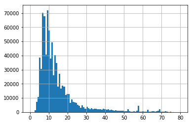

Markdown basics (http://daringfireball.net/projects/markdown/basics)
# NY Taxi Rides

### Data Provided by the New York City Taxi and Limousine Commission.
Full dataset is 170 million taxi trips, 100GB of free space. Our subset is 0.5% of all trips, about 850,000 rides. Download the dataset from Cyrille Rossant on GitHub: https://github.com/ipython-books/minibook-2nd-data (https://github.com/ipython-books/minibook-2nd-data) NYC Taxi & Limousine Commission website (http://www.nyc.gov/html/tlc/html/about/trip_record_data.shtml) NYC Gov data description website (http://www.nyc.gov/html/tlc/downloads/pdf/data_dictionary_trip_records_yellow.pdf)


```python
import numpy as np 
import pandas as pd 
import matplotlib.pyplot as plt 
%matplotlib inline
```


```python
data=pd.read_csv("nyc_data.csv")#Upload the data
```

head() method of DataFrames displays the first three lines of the table


```python
data.head()#Display the data
```


<div>
<style scoped>
    .dataframe tbody tr th:only-of-type {
        vertical-align: middle;
    }

    .dataframe tbody tr th {
        vertical-align: top;
    }

    .dataframe thead th {
        text-align: right;
    }
</style>
<table border="1" class="dataframe">
  <thead>
    <tr style="text-align: right;">
      <th></th>
      <th>medallion</th>
      <th>hack_license</th>
      <th>vendor_id</th>
      <th>rate_code</th>
      <th>store_and_fwd_flag</th>
      <th>pickup_datetime</th>
      <th>dropoff_datetime</th>
      <th>passenger_count</th>
      <th>trip_time_in_secs</th>
      <th>trip_distance</th>
      <th>pickup_longitude</th>
      <th>pickup_latitude</th>
      <th>dropoff_longitude</th>
      <th>dropoff_latitude</th>
    </tr>
  </thead>
  <tbody>
    <tr>
      <th>0</th>
      <td>76942C3205E17D7E7FE5A9F709D16434</td>
      <td>25BA06A87905667AA1FE5990E33F0E2E</td>
      <td>VTS</td>
      <td>1</td>
      <td>NaN</td>
      <td>2013-01-01 00:00:00</td>
      <td>2013-01-01 00:05:00</td>
      <td>3</td>
      <td>300</td>
      <td>0.61</td>
      <td>-73.955925</td>
      <td>40.781887</td>
      <td>-73.963181</td>
      <td>40.777832</td>
    </tr>
    <tr>
      <th>1</th>
      <td>517C6B330DBB3F055D007B07512628B3</td>
      <td>2C19FBEE1A6E05612EFE4C958C14BC7F</td>
      <td>VTS</td>
      <td>1</td>
      <td>NaN</td>
      <td>2013-01-01 00:05:00</td>
      <td>2013-01-01 00:21:00</td>
      <td>1</td>
      <td>960</td>
      <td>3.28</td>
      <td>-74.005501</td>
      <td>40.745735</td>
      <td>-73.964943</td>
      <td>40.755722</td>
    </tr>
    <tr>
      <th>2</th>
      <td>ED15611F168E41B33619C83D900FE266</td>
      <td>754AEBD7C80DA17BA1D81D89FB6F4D1D</td>
      <td>CMT</td>
      <td>1</td>
      <td>N</td>
      <td>2013-01-01 00:05:52</td>
      <td>2013-01-01 00:12:18</td>
      <td>1</td>
      <td>386</td>
      <td>1.50</td>
      <td>-73.969955</td>
      <td>40.799770</td>
      <td>-73.954567</td>
      <td>40.787392</td>
    </tr>
    <tr>
      <th>3</th>
      <td>B33E704CC189E80C9671230C16527BBC</td>
      <td>6789C77E1CBDC850C450D72204702976</td>
      <td>VTS</td>
      <td>1</td>
      <td>NaN</td>
      <td>2013-01-01 00:06:00</td>
      <td>2013-01-01 00:06:00</td>
      <td>6</td>
      <td>0</td>
      <td>0.00</td>
      <td>-73.991432</td>
      <td>40.755081</td>
      <td>-73.991417</td>
      <td>40.755085</td>
    </tr>
    <tr>
      <th>4</th>
      <td>BD5CC6A22D05EB2D5C8235526A2A4276</td>
      <td>5E8F2C93B5220A922699FEBAFC2F7A54</td>
      <td>VTS</td>
      <td>1</td>
      <td>NaN</td>
      <td>2013-01-01 00:06:00</td>
      <td>2013-01-01 00:12:00</td>
      <td>2</td>
      <td>360</td>
      <td>1.31</td>
      <td>-73.966225</td>
      <td>40.773716</td>
      <td>-73.955399</td>
      <td>40.782597</td>
    </tr>
  </tbody>
</table>
</div>


```python
data.shape # There are 846945 rows and 14 columns
```


    (846945, 14)


```python
data.ndim # Dimensions are two
```


    2


```python
data.duplicated().sum() # There is no duplicated rows
```


    0


```python
data.isnull().sum() # In store_and_fwd_flag there are 422368 NaN values
```


    medallion                  0
    hack_license               0
    vendor_id                  0
    rate_code                  0
    store_and_fwd_flag    422368
    pickup_datetime            0
    dropoff_datetime           0
    passenger_count            0
    trip_time_in_secs          0
    trip_distance              0
    pickup_longitude           0
    pickup_latitude            0
    dropoff_longitude          0
    dropoff_latitude           0
    dtype: int64


Get the actual coordinates: four DataFrame columns
These four variables are all Series objects:


```python
data.dtypes # Check vairable types of each column
```


    medallion              object
    hack_license           object
    vendor_id              object
    rate_code               int64
    store_and_fwd_flag     object
    pickup_datetime        object
    dropoff_datetime       object
    passenger_count         int64
    trip_time_in_secs       int64
    trip_distance         float64
    pickup_longitude      float64
    pickup_latitude       float64
    dropoff_longitude     float64
    dropoff_latitude      float64
    dtype: object


```python
data.describe() # Get basic statistics
```


<div>
<style scoped>
    .dataframe tbody tr th:only-of-type {
        vertical-align: middle;
    }

    .dataframe tbody tr th {
        vertical-align: top;
    }

    .dataframe thead th {
        text-align: right;
    }
</style>
<table border="1" class="dataframe">
  <thead>
    <tr style="text-align: right;">
      <th></th>
      <th>rate_code</th>
      <th>passenger_count</th>
      <th>trip_time_in_secs</th>
      <th>trip_distance</th>
      <th>pickup_longitude</th>
      <th>pickup_latitude</th>
      <th>dropoff_longitude</th>
      <th>dropoff_latitude</th>
    </tr>
  </thead>
  <tbody>
    <tr>
      <th>count</th>
      <td>846945.000000</td>
      <td>846945.000000</td>
      <td>8.469450e+05</td>
      <td>8.469450e+05</td>
      <td>846945.000000</td>
      <td>846945.000000</td>
      <td>846945.000000</td>
      <td>846945.000000</td>
    </tr>
    <tr>
      <th>mean</th>
      <td>1.026123</td>
      <td>1.710272</td>
      <td>8.125239e+02</td>
      <td>9.958211e+00</td>
      <td>-73.975155</td>
      <td>40.750490</td>
      <td>-73.974197</td>
      <td>40.750967</td>
    </tr>
    <tr>
      <th>std</th>
      <td>0.223480</td>
      <td>1.375266</td>
      <td>1.609831e+04</td>
      <td>6.525205e+03</td>
      <td>0.035142</td>
      <td>0.027224</td>
      <td>0.033453</td>
      <td>0.030766</td>
    </tr>
    <tr>
      <th>min</th>
      <td>0.000000</td>
      <td>0.000000</td>
      <td>-1.000000e+01</td>
      <td>0.000000e+00</td>
      <td>-74.098305</td>
      <td>40.009911</td>
      <td>-74.099998</td>
      <td>40.009911</td>
    </tr>
    <tr>
      <th>25%</th>
      <td>1.000000</td>
      <td>1.000000</td>
      <td>3.610000e+02</td>
      <td>1.050000e+00</td>
      <td>-73.992371</td>
      <td>40.736031</td>
      <td>-73.991570</td>
      <td>40.735207</td>
    </tr>
    <tr>
      <th>50%</th>
      <td>1.000000</td>
      <td>1.000000</td>
      <td>6.000000e+02</td>
      <td>1.800000e+00</td>
      <td>-73.982094</td>
      <td>40.752975</td>
      <td>-73.980614</td>
      <td>40.753597</td>
    </tr>
    <tr>
      <th>75%</th>
      <td>1.000000</td>
      <td>2.000000</td>
      <td>9.600000e+02</td>
      <td>3.200000e+00</td>
      <td>-73.968048</td>
      <td>40.767460</td>
      <td>-73.965157</td>
      <td>40.768227</td>
    </tr>
    <tr>
      <th>max</th>
      <td>6.000000</td>
      <td>6.000000</td>
      <td>4.294796e+06</td>
      <td>6.005123e+06</td>
      <td>-73.028473</td>
      <td>40.996132</td>
      <td>-73.027061</td>
      <td>40.998592</td>
    </tr>
  </tbody>
</table>
</div>


```python
# Check categorical variable frequencies
data.describe(include=['object'])
```


<div>
<style scoped>
    .dataframe tbody tr th:only-of-type {
        vertical-align: middle;
    }

    .dataframe tbody tr th {
        vertical-align: top;
    }

    .dataframe thead th {
        text-align: right;
    }
</style>
<table border="1" class="dataframe">
  <thead>
    <tr style="text-align: right;">
      <th></th>
      <th>medallion</th>
      <th>hack_license</th>
      <th>vendor_id</th>
      <th>store_and_fwd_flag</th>
      <th>pickup_datetime</th>
      <th>dropoff_datetime</th>
    </tr>
  </thead>
  <tbody>
    <tr>
      <th>count</th>
      <td>846945</td>
      <td>846945</td>
      <td>846945</td>
      <td>424577</td>
      <td>846945</td>
      <td>846945</td>
    </tr>
    <tr>
      <th>unique</th>
      <td>13446</td>
      <td>38391</td>
      <td>2</td>
      <td>2</td>
      <td>685423</td>
      <td>686957</td>
    </tr>
    <tr>
      <th>top</th>
      <td>20BA941F62CC07F1FA3EF3E122B1E9B2</td>
      <td>03173DD93C1171DA1788E6E7D733C5A9</td>
      <td>CMT</td>
      <td>N</td>
      <td>2013-02-14 19:36:00</td>
      <td>2013-01-20 01:03:00</td>
    </tr>
    <tr>
      <th>freq</th>
      <td>125</td>
      <td>97</td>
      <td>424678</td>
      <td>414599</td>
      <td>9</td>
      <td>9</td>
    </tr>
  </tbody>
</table>
</div>


```python
p_lng = data.pickup_longitude
p_lat = data.pickup_latitude
d_lng = data.dropoff_longitude
d_lat = data.dropoff_latitude
```


```python
# a Series is an indexed list of values.
p_lng.head()
```


    0   -73.955925
    1   -74.005501
    2   -73.969955
    3   -73.991432
    4   -73.966225
    Name: pickup_longitude, dtype: float64


```python
# Get the coordinates of points in pixels from geographical coordinates.
def lat_lng_to_pixels(lat, lng):
    lat_rad = lat * np.pi / 180.0
    lat_rad = np.log(np.tan((lat_rad + np.pi / 2.0) / 2.0))
    x = 100 * (lng + 180.0) / 360.0
    y = 100 * (lat_rad - np.pi) / (2.0 * np.pi)
    return (x, y)
```


```python
# Get pickup coordinates from pickup latitude and longitude
px, py = lat_lng_to_pixels(p_lat, p_lng)
py.head()
```


    0   -37.572749
    1   -37.586007
    2   -37.566187
    3   -37.582580
    4   -37.575746
    Name: pickup_latitude, dtype: float64


Display a scatter plot of pickup locations
Matplotlib scatter function makes a scatter plot of x vs y, where x and y are sequence like objects of the same
length.
Documentation: http://matplotlib.org/api/pyplot_api.html#matplotlib.pyplot.scatter
(http://matplotlib.org/api/pyplot_api.html#matplotlib.pyplot.scatter)


```python
plt.scatter(px, py, c='g') # Display a scatter plot of pick up locations.  
```


    <matplotlib.collections.PathCollection at 0x133b096a0>


```python
# For which vendor is it easiest to find a cab?
len(data[data.vendor_id=='VTS'].groupby(['pickup_longitude','pickup_latitude']).size())
```


    416171


```python
len(data[data.vendor_id=='CMT'].groupby(['pickup_longitude','pickup_latitude']).size()) 
# CMT has more pick up locations therefore CMT vendor is more easier to find a cab
```


    419191


### Customize our plot:
- Make markers smaller
- Make fewer points by making some points transparent
- Zoom in around Manhattan
- Make figure bigger
- Don't display the axes

plt or matplotlib.pyplot is a collection of command style functions. Each pyplot function makes some change to
a figure: e.g., creates a figure, creates a plotting area in a figure, plots some lines in a plotting area, decorates
the plot with labels, etc. ...


```python
# Specify the figure size
plt.figure(figsize=(8, 6))
# s argument is used to make the marker size smaller
# alpha specifies opacity
plt.scatter(px, py, s=.1, alpha=0.03)
# equal aspect ratio
plt.axis('equal')
# zoom in
plt.xlim(29.40, 29.55)
plt.ylim(-37.63, -37.54)
# remove the axes
plt.axis('off')
```


    (29.4, 29.55, -37.63, -37.54)


## Display a histogram of the trip distances.
pandas Series hist() draws histogram of the input Series using Matplotlib: documentation
(http://pandas.pydata.org/pandas-docs/stable/generated/pandas.Series.hist.html).

Manhattan Island is 13.4 miles long and 2.3 miles wide.

What is a histogram? (https://statistics.laerd.com/statistical-guides/understanding-histograms.php)
numpy linspace() returns evenly spaced numbers over a specified interval.
Parameters: start - interval start; stop - interval stop; num - number of numbers. numpy linspace()
documentation (https://docs.scipy.org/doc/numpy/reference/generated/numpy.linspace.html)


```python
bin_array = np.linspace(start=0., stop=10., num=100)
bin_array
```


    array([ 0.        ,  0.1010101 ,  0.2020202 ,  0.3030303 ,  0.4040404 ,
            0.50505051,  0.60606061,  0.70707071,  0.80808081,  0.90909091,
            1.01010101,  1.11111111,  1.21212121,  1.31313131,  1.41414141,
            1.51515152,  1.61616162,  1.71717172,  1.81818182,  1.91919192,
            2.02020202,  2.12121212,  2.22222222,  2.32323232,  2.42424242,
            2.52525253,  2.62626263,  2.72727273,  2.82828283,  2.92929293,
            3.03030303,  3.13131313,  3.23232323,  3.33333333,  3.43434343,
            3.53535354,  3.63636364,  3.73737374,  3.83838384,  3.93939394,
            4.04040404,  4.14141414,  4.24242424,  4.34343434,  4.44444444,
            4.54545455,  4.64646465,  4.74747475,  4.84848485,  4.94949495,
            5.05050505,  5.15151515,  5.25252525,  5.35353535,  5.45454545,
            5.55555556,  5.65656566,  5.75757576,  5.85858586,  5.95959596,
            6.06060606,  6.16161616,  6.26262626,  6.36363636,  6.46464646,
            6.56565657,  6.66666667,  6.76767677,  6.86868687,  6.96969697,
            7.07070707,  7.17171717,  7.27272727,  7.37373737,  7.47474747,
            7.57575758,  7.67676768,  7.77777778,  7.87878788,  7.97979798,
            8.08080808,  8.18181818,  8.28282828,  8.38383838,  8.48484848,
            8.58585859,  8.68686869,  8.78787879,  8.88888889,  8.98989899,
            9.09090909,  9.19191919,  9.29292929,  9.39393939,  9.49494949,
            9.5959596 ,  9.6969697 ,  9.7979798 ,  9.8989899 , 10.        ])


```python
data.trip_distance.hist(bins=bin_array)
```


    <matplotlib.axes._subplots.AxesSubplot at 0x114961da0>


```python
data.trip_distance.value_counts(bins=bin_array).idxmax()
# The most common trip distance based on bin_array locates in 0.909 to 1.01
```


    Interval(0.909, 1.01, closed='right')


```python
data.loc[:,"trip_distance"].mode()
# Therefore the most common trip distance is 1.0
```


    0    1.0
    dtype: float64


```python
fare=pd.read_csv("nyc_fare.csv")# Upload the fare data
```


```python
fare.head() # Get basic statistics
```


<div>
<style scoped>
    .dataframe tbody tr th:only-of-type {
        vertical-align: middle;
    }

    .dataframe tbody tr th {
        vertical-align: top;
    }

    .dataframe thead th {
        text-align: right;
    }
</style>
<table border="1" class="dataframe">
  <thead>
    <tr style="text-align: right;">
      <th></th>
      <th>medallion</th>
      <th>hack_license</th>
      <th>vendor_id</th>
      <th>pickup_datetime</th>
      <th>payment_type</th>
      <th>fare_amount</th>
      <th>surcharge</th>
      <th>mta_tax</th>
      <th>tip_amount</th>
      <th>tolls_amount</th>
      <th>total_amount</th>
    </tr>
  </thead>
  <tbody>
    <tr>
      <th>0</th>
      <td>76942C3205E17D7E7FE5A9F709D16434</td>
      <td>25BA06A87905667AA1FE5990E33F0E2E</td>
      <td>VTS</td>
      <td>2013-01-01 00:00:00</td>
      <td>CSH</td>
      <td>5.0</td>
      <td>0.5</td>
      <td>0.5</td>
      <td>0.0</td>
      <td>0.0</td>
      <td>6.0</td>
    </tr>
    <tr>
      <th>1</th>
      <td>517C6B330DBB3F055D007B07512628B3</td>
      <td>2C19FBEE1A6E05612EFE4C958C14BC7F</td>
      <td>VTS</td>
      <td>2013-01-01 00:05:00</td>
      <td>CRD</td>
      <td>13.5</td>
      <td>0.5</td>
      <td>0.5</td>
      <td>2.8</td>
      <td>0.0</td>
      <td>17.3</td>
    </tr>
    <tr>
      <th>2</th>
      <td>ED15611F168E41B33619C83D900FE266</td>
      <td>754AEBD7C80DA17BA1D81D89FB6F4D1D</td>
      <td>CMT</td>
      <td>2013-01-01 00:05:52</td>
      <td>CSH</td>
      <td>7.5</td>
      <td>0.5</td>
      <td>0.5</td>
      <td>0.0</td>
      <td>0.0</td>
      <td>8.5</td>
    </tr>
    <tr>
      <th>3</th>
      <td>B33E704CC189E80C9671230C16527BBC</td>
      <td>6789C77E1CBDC850C450D72204702976</td>
      <td>VTS</td>
      <td>2013-01-01 00:06:00</td>
      <td>CSH</td>
      <td>2.5</td>
      <td>0.5</td>
      <td>0.5</td>
      <td>0.0</td>
      <td>0.0</td>
      <td>3.5</td>
    </tr>
    <tr>
      <th>4</th>
      <td>BD5CC6A22D05EB2D5C8235526A2A4276</td>
      <td>5E8F2C93B5220A922699FEBAFC2F7A54</td>
      <td>VTS</td>
      <td>2013-01-01 00:06:00</td>
      <td>CSH</td>
      <td>6.5</td>
      <td>0.5</td>
      <td>0.5</td>
      <td>0.0</td>
      <td>0.0</td>
      <td>7.5</td>
    </tr>
  </tbody>
</table>
</div>


```python
fare.describe()
```


<div>
<style scoped>
    .dataframe tbody tr th:only-of-type {
        vertical-align: middle;
    }

    .dataframe tbody tr th {
        vertical-align: top;
    }

    .dataframe thead th {
        text-align: right;
    }
</style>
<table border="1" class="dataframe">
  <thead>
    <tr style="text-align: right;">
      <th></th>
      <th>fare_amount</th>
      <th>surcharge</th>
      <th>mta_tax</th>
      <th>tip_amount</th>
      <th>tolls_amount</th>
      <th>total_amount</th>
    </tr>
  </thead>
  <tbody>
    <tr>
      <th>count</th>
      <td>846945.000000</td>
      <td>846945.000000</td>
      <td>846945.000000</td>
      <td>846945.00000</td>
      <td>846945.000000</td>
      <td>846945.000000</td>
    </tr>
    <tr>
      <th>mean</th>
      <td>12.190578</td>
      <td>0.320303</td>
      <td>0.499305</td>
      <td>1.34466</td>
      <td>0.232142</td>
      <td>14.587073</td>
    </tr>
    <tr>
      <th>std</th>
      <td>9.514150</td>
      <td>0.772642</td>
      <td>0.057844</td>
      <td>2.09149</td>
      <td>1.109164</td>
      <td>11.380950</td>
    </tr>
    <tr>
      <th>min</th>
      <td>-648.420000</td>
      <td>-1.000000</td>
      <td>-0.500000</td>
      <td>0.00000</td>
      <td>0.000000</td>
      <td>-52.500000</td>
    </tr>
    <tr>
      <th>25%</th>
      <td>6.500000</td>
      <td>0.000000</td>
      <td>0.500000</td>
      <td>0.00000</td>
      <td>0.000000</td>
      <td>8.000000</td>
    </tr>
    <tr>
      <th>50%</th>
      <td>9.500000</td>
      <td>0.000000</td>
      <td>0.500000</td>
      <td>1.00000</td>
      <td>0.000000</td>
      <td>11.000000</td>
    </tr>
    <tr>
      <th>75%</th>
      <td>14.000000</td>
      <td>0.500000</td>
      <td>0.500000</td>
      <td>2.00000</td>
      <td>0.000000</td>
      <td>16.500000</td>
    </tr>
    <tr>
      <th>max</th>
      <td>620.010000</td>
      <td>628.840000</td>
      <td>41.490000</td>
      <td>200.00000</td>
      <td>100.660000</td>
      <td>620.010000</td>
    </tr>
  </tbody>
</table>
</div>


```python
fare.info()
```

    <class 'pandas.core.frame.DataFrame'>
    RangeIndex: 846945 entries, 0 to 846944
    Data columns (total 11 columns):
    medallion          846945 non-null object
    hack_license       846945 non-null object
    vendor_id          846945 non-null object
    pickup_datetime    846945 non-null object
    payment_type       846945 non-null object
    fare_amount        846945 non-null float64
    surcharge          846945 non-null float64
    mta_tax            846945 non-null float64
    tip_amount         846945 non-null float64
    tolls_amount       846945 non-null float64
    total_amount       846945 non-null float64
    dtypes: float64(6), object(5)
    memory usage: 71.1+ MB


```python
fare.duplicated().sum() # There is no duplicated rows
```


    0


```python
# Check categorical variable frequencies
fare.describe(include=['object'])
```


<div>
<style scoped>
    .dataframe tbody tr th:only-of-type {
        vertical-align: middle;
    }

    .dataframe tbody tr th {
        vertical-align: top;
    }

    .dataframe thead th {
        text-align: right;
    }
</style>
<table border="1" class="dataframe">
  <thead>
    <tr style="text-align: right;">
      <th></th>
      <th>medallion</th>
      <th>hack_license</th>
      <th>vendor_id</th>
      <th>pickup_datetime</th>
      <th>payment_type</th>
    </tr>
  </thead>
  <tbody>
    <tr>
      <th>count</th>
      <td>846945</td>
      <td>846945</td>
      <td>846945</td>
      <td>846945</td>
      <td>846945</td>
    </tr>
    <tr>
      <th>unique</th>
      <td>13446</td>
      <td>38391</td>
      <td>2</td>
      <td>685423</td>
      <td>5</td>
    </tr>
    <tr>
      <th>top</th>
      <td>20BA941F62CC07F1FA3EF3E122B1E9B2</td>
      <td>03173DD93C1171DA1788E6E7D733C5A9</td>
      <td>CMT</td>
      <td>2013-02-14 19:36:00</td>
      <td>CRD</td>
    </tr>
    <tr>
      <th>freq</th>
      <td>125</td>
      <td>97</td>
      <td>424678</td>
      <td>9</td>
      <td>456019</td>
    </tr>
  </tbody>
</table>
</div>


```python
bin_array2 = np.linspace(start=0., stop=80., num=100)
bin_array2
```


    array([ 0.        ,  0.80808081,  1.61616162,  2.42424242,  3.23232323,
            4.04040404,  4.84848485,  5.65656566,  6.46464646,  7.27272727,
            8.08080808,  8.88888889,  9.6969697 , 10.50505051, 11.31313131,
           12.12121212, 12.92929293, 13.73737374, 14.54545455, 15.35353535,
           16.16161616, 16.96969697, 17.77777778, 18.58585859, 19.39393939,
           20.2020202 , 21.01010101, 21.81818182, 22.62626263, 23.43434343,
           24.24242424, 25.05050505, 25.85858586, 26.66666667, 27.47474747,
           28.28282828, 29.09090909, 29.8989899 , 30.70707071, 31.51515152,
           32.32323232, 33.13131313, 33.93939394, 34.74747475, 35.55555556,
           36.36363636, 37.17171717, 37.97979798, 38.78787879, 39.5959596 ,
           40.4040404 , 41.21212121, 42.02020202, 42.82828283, 43.63636364,
           44.44444444, 45.25252525, 46.06060606, 46.86868687, 47.67676768,
           48.48484848, 49.29292929, 50.1010101 , 50.90909091, 51.71717172,
           52.52525253, 53.33333333, 54.14141414, 54.94949495, 55.75757576,
           56.56565657, 57.37373737, 58.18181818, 58.98989899, 59.7979798 ,
           60.60606061, 61.41414141, 62.22222222, 63.03030303, 63.83838384,
           64.64646465, 65.45454545, 66.26262626, 67.07070707, 67.87878788,
           68.68686869, 69.49494949, 70.3030303 , 71.11111111, 71.91919192,
           72.72727273, 73.53535354, 74.34343434, 75.15151515, 75.95959596,
           76.76767677, 77.57575758, 78.38383838, 79.19191919, 80.        ])


```python
## Display a histogram of the fare total amounts
fare.total_amount.hist(bins=bin_array2)
```


    <matplotlib.axes._subplots.AxesSubplot at 0x15415bb38>





```python
# The most common fare total_amount based on bin_array locates in 8.899 to 9.697
fare.total_amount.value_counts(bins=bin_array2).idxmax()
```


    Interval(8.889, 9.697, closed='right')


```python
print("From the hitogram of the fare total amounts, the fare could vary from 5 to 20 if we only set the frequency at 10000, but the total amount of fare mostly are in the range of 6 to 10.")
```

    From the hitogram of the fare total amounts, the fare could vary from 5 to 20 if we only set the frequency at 10000, but the total amount of fare mostly are in the range of 6 to 10.


## Filtering with boolean indexing
### Select long rides

data.loc[data.trip_distance > 100]


```python
long_ride=data.loc[data.trip_distance > 100]
long_ride
```


<div>
<style scoped>
    .dataframe tbody tr th:only-of-type {
        vertical-align: middle;
    }

    .dataframe tbody tr th {
        vertical-align: top;
    }

    .dataframe thead th {
        text-align: right;
    }
</style>
<table border="1" class="dataframe">
  <thead>
    <tr style="text-align: right;">
      <th></th>
      <th>medallion</th>
      <th>hack_license</th>
      <th>vendor_id</th>
      <th>rate_code</th>
      <th>store_and_fwd_flag</th>
      <th>pickup_datetime</th>
      <th>dropoff_datetime</th>
      <th>passenger_count</th>
      <th>trip_time_in_secs</th>
      <th>trip_distance</th>
      <th>pickup_longitude</th>
      <th>pickup_latitude</th>
      <th>dropoff_longitude</th>
      <th>dropoff_latitude</th>
    </tr>
  </thead>
  <tbody>
    <tr>
      <th>504497</th>
      <td>7237EC7ABD6114EDDC87A3AA846F8418</td>
      <td>D52502537E2DF62C9BFFECF5A387E7E9</td>
      <td>CMT</td>
      <td>1</td>
      <td>N</td>
      <td>2013-08-02 11:22:31</td>
      <td>2013-08-02 11:33:03</td>
      <td>1</td>
      <td>631</td>
      <td>6005123.0</td>
      <td>-73.997467</td>
      <td>40.736397</td>
      <td>-73.991882</td>
      <td>40.764629</td>
    </tr>
    <tr>
      <th>507107</th>
      <td>50DA72F510E2F84A42712E13744FAC7B</td>
      <td>EA9D03A766C1D32A6668FFF0C1EB4E4B</td>
      <td>CMT</td>
      <td>1</td>
      <td>N</td>
      <td>2013-08-04 18:42:17</td>
      <td>2013-08-04 20:37:19</td>
      <td>3</td>
      <td>4290965</td>
      <td>181.8</td>
      <td>-73.978020</td>
      <td>40.765167</td>
      <td>-73.815041</td>
      <td>40.730076</td>
    </tr>
    <tr>
      <th>548988</th>
      <td>A978A0AAE9B2CFEE310FACD97A09C319</td>
      <td>CE56A27F53ABF411094B6CD708BFBA96</td>
      <td>CMT</td>
      <td>1</td>
      <td>N</td>
      <td>2013-08-24 17:03:27</td>
      <td>2013-08-24 17:03:29</td>
      <td>1</td>
      <td>1</td>
      <td>442.0</td>
      <td>-73.993896</td>
      <td>40.702644</td>
      <td>-73.993874</td>
      <td>40.702637</td>
    </tr>
    <tr>
      <th>558665</th>
      <td>5A5C516A820FE476E9D3E14101B669AC</td>
      <td>C24585AA866FC76A4E09A05F55DC7E54</td>
      <td>CMT</td>
      <td>2</td>
      <td>N</td>
      <td>2013-08-29 10:01:40</td>
      <td>2013-08-29 11:52:20</td>
      <td>1</td>
      <td>6640</td>
      <td>164.4</td>
      <td>-73.791534</td>
      <td>40.661026</td>
      <td>-73.983734</td>
      <td>40.765778</td>
    </tr>
  </tbody>
</table>
</div>


```python
len(long_ride)
```


    4


```python
print ("There are four unusually long trips (greater than 100 miles) I saw.")
```

    There are four unusually long trips (greater than 100 miles) I saw.


```python
#End
```
